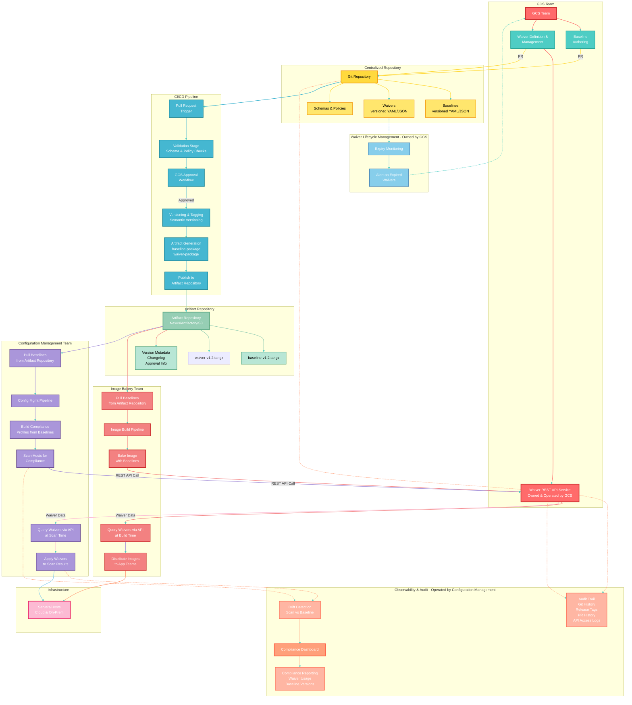

```mermaid
graph TB
    subgraph "GCS Team "
        GCS[GCS Team]
        BaselineAuthor[Baseline 
        Authoring]
        WaiverDefinition[Waiver Definition & 
        Management]
        WaiverAPI[Waiver REST API Service<br/>Owned & Operated by GCS]

        GCS --> BaselineAuthor
        GCS --> WaiverDefinition
        WaiverDefinition --> WaiverAPI
    end

    subgraph "Centralized Repository"
        GitRepo[Git Repository]
        BaselineFiles[Baselines<br/>versioned YAML/JSON]
        WaiverFiles[Waivers<br/>versioned YAML/JSON]
        SchemaFiles[Schemas & Policies]

        BaselineAuthor --> |PR| GitRepo
        WaiverDefinition --> |PR| GitRepo
        GitRepo --> BaselineFiles
        GitRepo --> WaiverFiles
        GitRepo --> SchemaFiles
    end

    subgraph "CI/CD Pipeline"
        PRTrigger[Pull Request<br/>Trigger]
        Validation[Validation Stage<br/>Schema & Policy Checks]
        Approval[GCS Approval<br/>Workflow]
        Versioning[Versioning & Tagging<br/>Semantic Versioning]
        ArtifactBuild[Artifact Generation<br/>baseline-package<br/>waiver-package]
        Publish[Publish to<br/>Artifact Repository]

        GitRepo --> PRTrigger
        PRTrigger --> Validation
        Validation --> Approval
        Approval --> |Approved| Versioning
        Versioning --> ArtifactBuild
        ArtifactBuild --> Publish
    end

    subgraph "Artifact Repository"
        ArtifactRepo[Artifact Repository<br/>Nexus/Artifactory/S3]
        BaselineArtifact[baseline-v1.2.tar.gz]
        WaiverArtifact[waiver-v1.2.tar.gz]
        Metadata[Version Metadata<br/>Changelog<br/>Approval Info]

        Publish --> ArtifactRepo
        ArtifactRepo --> BaselineArtifact
        ArtifactRepo --> WaiverArtifact
        ArtifactRepo --> Metadata
    end

    subgraph "Image Bakery Team"
        ImageBuild[Image Build Pipeline]
        ImagePull[Pull Baselines<br/>from Artifact Repository]
        ImageBake[Bake Image<br/>with Baselines]
        ImageQueryWaiver[Query Waivers via API<br/>at Build Time]
        ImageDist[Distribute Images<br/>to App Teams]

        ArtifactRepo --> ImagePull
        ImagePull --> ImageBuild
        ImageBuild --> ImageBake
        ImageBake --> |REST API Call| WaiverAPI
        WaiverAPI --> |Waiver Data| ImageQueryWaiver
        ImageQueryWaiver --> ImageDist
    end

    subgraph "Configuration Management Team"
        ConfigMgmt[Config Mgmt Pipeline]
        ConfigPull[Pull Baselines<br/>from Artifact Repository]
        ComplianceProfile[Build Compliance<br/>Profiles from Baselines]
        ScanHosts[Scan Hosts for<br/>Compliance]
        ConfigQueryWaiver[Query Waivers via API<br/>at Scan Time]
        WaiverApply[Apply Waivers<br/>to Scan Results]

        ArtifactRepo --> ConfigPull
        ConfigPull --> ConfigMgmt
        ConfigMgmt --> ComplianceProfile
        ComplianceProfile --> ScanHosts
        ScanHosts --> |REST API Call| WaiverAPI
        WaiverAPI --> |Waiver Data| ConfigQueryWaiver
        ConfigQueryWaiver --> WaiverApply
    end

    subgraph "Observability & Audit - Operated by Configuration Management"
        Dashboard[Compliance Dashboard]
        AuditLog[Audit Trail<br/>Git History<br/>Release Tags<br/>PR History<br/>API Access Logs]
        DriftDetection[Drift Detection<br/>Scan vs Baseline]
        Reporting[Compliance Reporting<br/>Waiver Usage<br/>Baseline Versions]

        ScanHosts -.-> DriftDetection
        WaiverApply -.-> DriftDetection
        GitRepo -.-> AuditLog
        WaiverAPI -.-> AuditLog
        DriftDetection --> Dashboard
        Dashboard --> Reporting
    end

    subgraph "Infrastructure"
        Hosts[Servers/Hosts<br/>Cloud & On-Prem]
        ImageDist --> Hosts
        WaiverApply --> Hosts
    end

    subgraph "Waiver Lifecycle Management - Owned by GCS"
        WaiverExpiry[Expiry Monitoring]
        WaiverAlert[Alert on Expired<br/>Waivers]

        WaiverFiles -.-> WaiverExpiry
        WaiverExpiry --> WaiverAlert
        WaiverAlert -.-> GCS
    end

    style GCS fill:#FF6B6B,stroke:#C92A2A,color:#fff,stroke-width:3px
    style BaselineAuthor fill:#4ECDC4,stroke:#1A9B8E,color:#fff,stroke-width:2px
    style WaiverDefinition fill:#4ECDC4,stroke:#1A9B8E,color:#fff,stroke-width:2px
    style WaiverAPI fill:#FF6B6B,stroke:#C92A2A,color:#fff,stroke-width:3px

    style GitRepo fill:#FFD93D,stroke:#F39C12,color:#000,stroke-width:3px
    style BaselineFiles fill:#FFE66D,stroke:#F39C12,color:#000,stroke-width:2px
    style WaiverFiles fill:#FFE66D,stroke:#F39C12,color:#000,stroke-width:2px
    style SchemaFiles fill:#FFE66D,stroke:#F39C12,color:#000,stroke-width:2px

    style PRTrigger fill:#45B7D1,stroke:#0B7A8F,color:#fff,stroke-width:2px
    style Validation fill:#45B7D1,stroke:#0B7A8F,color:#fff,stroke-width:2px
    style Approval fill:#45B7D1,stroke:#0B7A8F,color:#fff,stroke-width:2px
    style Versioning fill:#45B7D1,stroke:#0B7A8F,color:#fff,stroke-width:2px
    style ArtifactBuild fill:#45B7D1,stroke:#0B7A8F,color:#fff,stroke-width:2px
    style Publish fill:#45B7D1,stroke:#0B7A8F,color:#fff,stroke-width:2px

    style ArtifactRepo fill:#96CEB4,stroke:#52A37D,color:#fff,stroke-width:3px
    style BaselineArtifact fill:#B8E6D5,stroke:#52A37D,color:#000,stroke-width:2px
    style Metadata fill:#B8E6D5,stroke:#52A37D,color:#000,stroke-width:2px

    style ImageBuild fill:#F38181,stroke:#C92A2A,color:#fff,stroke-width:2px
    style ImagePull fill:#F38181,stroke:#C92A2A,color:#fff,stroke-width:2px
    style ImageBake fill:#F38181,stroke:#C92A2A,color:#fff,stroke-width:3px
    style ImageQueryWaiver fill:#F38181,stroke:#C92A2A,color:#fff,stroke-width:2px
    style ImageDist fill:#F38181,stroke:#C92A2A,color:#fff,stroke-width:2px

    style ConfigMgmt fill:#AA96DA,stroke:#6A4C93,color:#fff,stroke-width:2px
    style ConfigPull fill:#AA96DA,stroke:#6A4C93,color:#fff,stroke-width:2px
    style ComplianceProfile fill:#AA96DA,stroke:#6A4C93,color:#fff,stroke-width:2px
    style ScanHosts fill:#AA96DA,stroke:#6A4C93,color:#fff,stroke-width:3px
    style ConfigQueryWaiver fill:#AA96DA,stroke:#6A4C93,color:#fff,stroke-width:2px
    style WaiverApply fill:#AA96DA,stroke:#6A4C93,color:#fff,stroke-width:2px

    style Hosts fill:#FCBAD3,stroke:#E91E63,color:#fff,stroke-width:3px

    style Dashboard fill:#FFA07A,stroke:#FF6347,color:#fff,stroke-width:3px
    style AuditLog fill:#FFB6A3,stroke:#FF6347,color:#fff,stroke-width:2px
    style DriftDetection fill:#FFB6A3,stroke:#FF6347,color:#fff,stroke-width:2px
    style Reporting fill:#FFB6A3,stroke:#FF6347,color:#fff,stroke-width:2px

    style WaiverExpiry fill:#87CEEB,stroke:#4682B4,color:#fff,stroke-width:2px
    style WaiverAlert fill:#87CEEB,stroke:#4682B4,color:#fff,stroke-width:2px

    linkStyle default stroke:#4ECDC4,stroke-width:2px
    linkStyle 0,1,2 stroke:#FF6B6B,stroke-width:2px
    linkStyle 3,4,5,6,7 stroke:#FFD93D,stroke-width:2px
    linkStyle 8,9,10,11,12,13 stroke:#45B7D1,stroke-width:2px
    linkStyle 14,15,16 stroke:#96CEB4,stroke-width:2px
    linkStyle 17,18,19,20,21,22 stroke:#F38181,stroke-width:2px
    linkStyle 23,24,25,26,27,28 stroke:#AA96DA,stroke-width:2px
    linkStyle 29,30 stroke:#FCBAD3,stroke-width:2px
    linkStyle 31,32,33,34,35,36,37 stroke:#FFA07A,stroke-width:2px
    linkStyle 38,39,40 stroke:#87CEEB,stroke-width:2px
```
